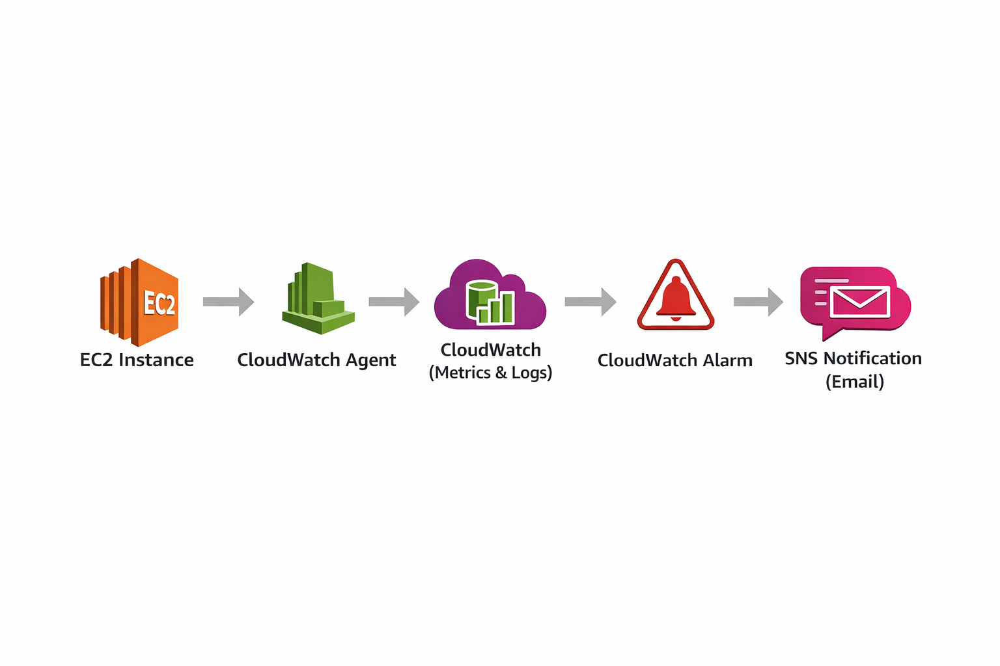

# AWS CloudWatch Monitoring Project

## Overview
This project demonstrates monitoring of an EC2 instance using CloudWatch Agent.

## Features
- Memory monitoring (mem_used_percent)
- Log collection (/var/log/messages)
- CloudWatch alarms
- SNS notifications

## Architecture

EC2 Instance
     ↓
CloudWatch Agent
     ↓
CloudWatch (Metrics + Logs)
     ↓
CloudWatch Alarm
     ↓
SNS Notification (Email)

## Setup Steps
1. Created EC2 instance with IAM role
2. Installed CloudWatch Agent using User Data
3. Configured metrics and logs
4. Verified metrics in CloudWatch
5. Created alarm and notifications
